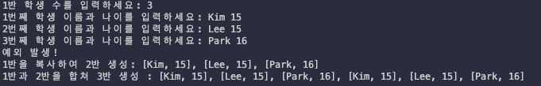

## Exercise01: 동적 크기 배열 구현하기

학교에서 학생 정보를 관리하는 간단한 application을 만들 것이다.

- 한 반의 학생 수와 학생 정보는 program 실행 시 input으로 받는다.

- 학생 data는 array와 유사한 data structure를 사용한다. 이 array는 다양한 size를 지원해야 한다.

- 여러 반을 하나로 합치는 기능도 지원한다.

1. 필요한 header file을 include한다.

```cpp
#include <iostream>
#include <sstream>
#include <algorithm>
```

2. dynamic_array라는 이름의 class template를 작성하고, 주요 member variable을 declaration한다.

```cpp
template <typename T>
class dynamic_array
{
    T* data;
    size_t n;
```

3. array size를 argument로 받는 constructor(생성자)와 copy constructor(복사 생성자)를 추가한다.

> copy constructor(복사 생성자)란 자신과 같은 class type의 다른 객체의 reference를 parameter로 전달받아서, 그 reference를 가지고 자신을 초기화하는 방법이다.

```cpp
public:
	dynamic_array(int n)
	{
		this->n = n;
		data = new T[n];
	}

	dynamic_array(const dynamic_array<T>& other)
	{
		n = other.n;
		data = new T[n];

		for (int i = 0; i < n; i++)
			data[i] = other[i];
	}
```

4. member data에 직접 접근하기 위한 operator[]와 `at()` function을 작성한다. operator[]를 제공함으로써 `std::array`와 비슷한 방식으로 array element에 접근할 수 있다.

```cpp
	T& operator[](int index)
	{
		return data[index];
	}

	const T& operator[](int index) const
	{
		return data[index];
	}

	T& at(int index)
	{
		if (index < n)
			return data[index];
		throw "Index out of range";
	}
```

5. array size를 반환하는 `size()` member function과 destructor(소멸자)를 구현한다.

> destructor는 memory leak을 방지하기 위해 allocate된 memory를 delete한다.

```cpp
    size_t size() const
    {
        return n;
    }

    ~dynamic_array()
    {
        delete[] data;    // memory leak 방지
    }
```

6. dynamic_array의 array element를 순회할 때 사용할 iterator 관련 function을 정의한다.

```cpp
	T* begin() { return data; }
	const T* begin() const { return data; }
	T* end() { return data + n; }
	const T* end() const { return data + n; }
```

7. 두 array를 하나로 합치는 연산을 수행하는 operator+ function을 정의한다. 이 function은 `friend`로 선언한다.

```cpp
	friend dynamic_array<T> operator+(const dynamic_array<T>& arr1, dynamic_array<T>& arr2)
	{
		dynamic_array<T> result(arr1.size() + arr2.size());
		std::copy(arr1.begin(), arr1.end(), result.begin());
		std::copy(arr2.begin(), arr2.end(), result.begin() + arr1.size());

		return result;
	}
```

8. array에 저장된 모든 data를 문자열로 반환하는 to_string() member function을 작성한다. 

- function은 data 구분을 위해 문자열 sep을 parameter로 받으며, sep의 default 값은 쉼표(",")로 지정할 것이다.

```cpp
	std::string to_string(const std::string& sep = ", ")
	{
		if (n == 0)
			return "";

		std::ostringstream os;
		os << data[0];

		for (int i = 1; i < n; i++)
			os << sep << data[i];

		return os.str();
	}
};
```

9. 학생 정보를 저장할 struct(구조체) student를 정의한다. 

- struct는 학생의 이름 'name'과, 학급 정보를 담고 있는 'standard' member를 가진다.

- operator<<를 이용한 표준 출력을 지원한다.

```cpp
struct student
{
	std::string name;
	int standard;
};

std::ostream& operator<<(std::ostream& os, const student& s)
{
	return (os << "[" << s.name << ", " << s.standard << "]");
}
```

10. main() function에서 dynamic_array를 사용하는 code를 작성한다.

```cpp
int main()
{
	int nStudents;
	std::cout << "1반 학생 수를 입력하세요: ";
	std::cin >> nStudents;

	dynamic_array<student> class1(nStudents);
	for (int i = 0; i < nStudents; i++)
	{
		std::string name;
		int standard;
		std::cout << i + 1 << "번째 학생 이름과 나이를 입력하세요: ";
		std::cin >> name >> standard;
		class1[i] = student{name, standard};
	}

	// 배열 크기보다 큰 인덱스의 학생에 접근
	try
	{
		// 아래 주석을 해제하면 프로그램이 비정상 종료합니다.
		// class1[nStudents] = student {"John", 8}; // 예상할 수 없는 동작

		class1.at(nStudents) = student{"John", 8}; // 예외 발생
	}
	catch (...)
	{
		std::cout << "예외 발생!" << std::endl;
	}

	// 깊은 복사
	auto class2 = class1;
	std::cout << "1반을 복사하여 2반 생성: " << class2.to_string() << std::endl;

	// 두 학급을 합쳐서 새로운 큰 학급을 생성
	auto class3 = class1 + class2;
	std::cout << "1반과 2반을 합쳐 3반 생성 : " << class3.to_string() << std::endl;

	return 0;
}
```

11. 작성한 program에 'Kim(15), Lee(15), Park(16)을 입력으로 사용하여 실행해 본다.

- compile 시 'g++ -std=c++17(혹은 c++11) -g Exercise01.cpp -o Exercise01'로 옵션을 추가해서 compile한다.



---