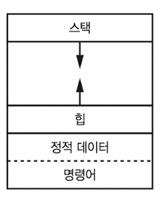
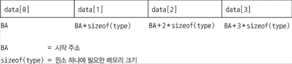
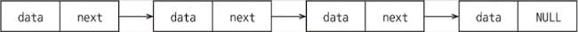
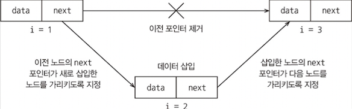
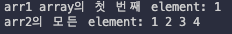

# 1 리스트, 스택, 큐

## 1.1 들어가며

application에서 data를 처리하기 앞서 먼저 data를 어떻게 저장할 것인가를 결정해야 한다. data를 이용하여 수행할 작업의 종류나, 작업의 빈도 등에 따라 적합한 data structure가 다르다. application이 제대로 동작함은 물론, 동시에 latency, memory 사용량, 또는 기타 parameter 측면에서 최선의 성능을 낼 수 있도록 구현해야 한다.

> algorithm complexity(알고리즘 복잡도), 또는 **time complexity**(시간 복잡도)를 주로 지표로 삼을 것이다.

이번 장은 C++에서 제공하는 기본적이고 널리 사용되는 **linear data structure**(선형 자료 구조)를 익힌다. 

---

## 1.2 contiguous data structure, linked data structures

---

### 1.2.1 contiguous data structure

**contiguous data structure**(연속된 자료 구조)는 모든 element를 단일 memory **chunk**(청크)에 저장한다.

> [Heap 기초](https://c0wb3ll.tistory.com/entry/Heap%EA%B8%B0%EC%B4%88-1)



**dynamic** data(동적 데이터. program을 실행하기 전까지는 알 수 없는 data)가 쌓이는 **heap**(힙) 영역은 사용자에 의해 memory 공간이 allocation된다. OS와 runtime library에서 구현되었으며, process가 시작될 때 OS에서는 process heap이라는 기본 heap을 만든다. 이 heap의 기본 단위가 바로 chunk이다.

> C/C++에서는 `malloc()`, `free()`, `new`, `delete` 연산자 등으로 heap을 allocation했다.

> application이나 load된 여러 DLL(동적 연결 라이브러리)는 이런 전용 heap 외에도 별도의 heap을 만들어서 사용할 수 있다.

아래는 contiguous data structure에 data가 저장된 모습을 그린 다이어그램이다.



- 이 사각형 전체가 바로 단일 memory chunk에 해당된다.

- 작은 사각형 하나는 각각의 element가 저장된 memory 공간이다.

- 각각의 element는 같은 type을 사용한다. 즉, 모든 element는 같은 size의 memory를 사용한다.

   - sizeof(type)만큼을 사용한다.

첫 번째 element의 address가 바로 **Base Address**(BA. 시작 주소)다. 따라서 두 번째 element의 address는 'BA + sizeof(type)'이고, 그 다음은 'BA + 2*sizeof(type)'이 된다. 수식으로 정리하면 'BA + i\*sizeof(type)'이 된다.

이런 data structure에서는 <U>array의 전체 크기와 상관 없이 BA와 offset을 이용한 수식으로 모든 element에 곧바로 접근할 수 있다.</U>(**읽기: O(1)**)

그리고 array의 유형은 크기 **static array**(정적 배열)와 **dynamic array**(동적 배열) 두 가지로 분류할 수 있다. 

- static array: declaration된 block이 끝나면 소멸된다.(**stack**(스택) memory 영역에 allocate되고, function을 벗어날 때 자동으로 해제된다.)

   - int arr[size] 형태로 declaration한다.

- dynamic array: programmer가 생성될 시점과 해제할 시점을 자유롭게 결정할 수 있다.(heap 영역에 allocate된다.)

   - C: int* arr = (int*)malloc(size * sizeof(int)); 형태로 declaration한다.

   - C++: int* arr = new int[size]; 형태로 declaration한다.

> 이 둘의 성능은 동일하며 C 언어에서 도입되었기 때문에 C style array라고도 한다. 

array 같은 contiguous data structure에서는 각 element가 서로 인접해 있기 때문에, 하나의 element에 접근할 때는 그 옆에 있는 element도 묶음으로 함께 **cache**로 가져온다. 따라서 이 다음 근접한 element를 접근할 때는 cache에서 가져오게 된다.

이런 속성을 **cache locality**(캐시 지역성)이라고 한다. 연산 자체의 **asymptotic time complexity**(점근적 시간 복잡도)에 영향을 주지는 않지만, element 접근 시간을 단축시켜서 latency를 줄인다.

다시 말하면 <U>array는 cache locality가 좋은 data structure</U>이다.

---

### 1.2.2 linked data structure

**linked data structure**(연결된 자료 구조)는 **node**(노드)라는 여러 개의 memory chunk에 data를 저장한다. 이때 서로 다른 memory 위치에 data가 저장된다.



- 각 노드는 다음 element를 가진다.

   - 저장할 **data**

   - 다음 node를 가리키는 pointer(**next**)
   
   - 맨 마지막 node는 다음 node를 가리키는 pointer 대신, data structure의 끝을 나타내는 NULL을 가진다.

위는 **linked list**(연결 리스트)의 다이어그램이다. linked list에서 특정 element에 접근하려면, list의 **head**(헤드), 즉 시작 부분에서 원하는 element까지 next pointer를 따라 이동해야 한다. 따라서 element 접근 시간은 element 개수에 비례하게 된다.(**읽기: O(n)**)

하지만 linked list는 pointer를 이용해서 <U>element의 삽입 또는 삭제를 매우 빠르게 수행</U>할 수 있다. 삽입은 새 node를 만들고 이전과 다음 node의 pointer를 수정하면 된다. 삭제는 이전 node를 다음 node에 연결하고, 삭제할 node는 allocation을 해제하거나 다른 적절한 처리를 해주면 된다.



linked list는 특성상 cache locality를 기대할 수 없다. 따라서 <U>모든 element를 순회하는 작업</U>이라고 했을 때, 이론적으로는 time complexity가 같지만 <U>실제로는 linked list의 성능이 더 떨어진다.</U>

---

### 1.2.3 C style array의 제약 사항

C style array는 array 역할을 충분히 수행하지만, 몇 가지 제약을 가지고 있어서 잘 사용되지는 않는다. 

1. memory 할당과 해제를 수동으로 처리해야 한다. 만약 해제하지 않으면 **memory leak**이 발생할 수 있고, 이 경우 해당 memory를 사용하지 못하는 상황이 발생한다.

2. [] operator에서 array 크기보다 큰 element를 참조하려는 시도를 방지하지 못한다. 이는 **segmentation fault**나 memory 손상을 일으킬 수 있다.

3. array를 중첩할 경우 문법이 복잡해져서 코드 이해가 힘들어진다.

4. **deep copy**가 기본으로 동작하지 않는다. 다시 말해 수동으로 구현해야 한다.

이를 방지할 수 있게 C++은 C style array를 대체하는 std::array를 제공한다.

---

## 1.3 std::array

`std::array`는 memory를 자동으로 allocate하고 free한다. element type과 array size를 parameter로 사용하는 class template이다.

다음은 size가 10인 int type의 `std::array`를 declaration한 뒤, element를 설정하거나 화면에 print하는 예제다.

- `std::cout <<`: c의 `printf`처럼 출력을 담당하는 function. 출력할 것이 여러 개면 <<를 여러 개 중첩하면 된다.

  - 개행을 하려면 `std::endl`을 사용하면 된다.

> g++ {파일명.cpp} -o {출력 파일명}으로 compile한 뒤 실행한다.

```cpp
// int type에 size 10을 갖는 array declaration
std::array<int, 10> arr1;

arr1[0] = 1;    // 첫 번째 element는 1
std::cout << "arr1 array의 첫 번째 element: " << arr1[0] << std::endl;

// declaration(선언)과 definition(정의)를 함께 수행
std::array<int, 4> arr2 = {1, 2, 3, 4};
std::cout << "arr2의 모든 element: ";

for (int i = 0; i < arr2.size(); i++) {
   std::cout << arr2[i] << " ";
}
std::cout << std::endl;
```

결과는 다음과 같이 출력된다.



`std::array`는 빠른 동작을 위해 C와 마찬가지로 전달된 index 값이 array size보다 큰지 작은지를 검사하지는 않는다. 대신 `at(index)` 형식의 function을 제공하는데, 이를 사용하면 전달된 index 값이 유효하지 않을 때 `std::out_of_range` exception(예외)를 발생시킨다.

> 따라서 `at(index)`가 [] operator보다는 느리지만, exception을 적절하게 처리할 수 있다.

이번에는 `at(index)` function을 사용한 예외 처리 code를 보자.

- `what()` function을 이용해서 해당 값을 살펴볼 수 있다.

```cpp
std::array<int, 4> arr3 = {1, 2, 3, 4};

try 
{
   // 정상 코드
   std::cout << arr3.at(3) << std::endl;
   // std::out_of_range 발생
   std::cout << arr3.at(4) << std::endl;
}
catch (const std::out_of_range& ex)
{
   std::cerr << ex.what() << std::endl;
}
```

`std::array` 객체를 다른 function에 전달하는 방식도 기본 data type과 유사하게 가능하다. 값 또는 reference(참조)로 전달할 수도 있고, const를 함께 사용할 수도 있다.

> C처럼 array를 function으로 전달할 때처럼, pointer 연산을 사용하거나, reference 혹은 de-reference(역참조) 연산을 하지 않아도 된다.

```cpp
void print(std::array<int, 5> arr)
{
   for (auto ele : arr) {
      std::cout << ele << ", ";
   }
}

std::array<int, 5> arr = {1, 2, 3, 4, 5};
print(arr);
```

지금 예제에서는 array size를 고정했기 때문에 다른 size의 array를 전달할 수 없다. 만약 다양한 크기의 `std::array` 객체에서 동작하게 만들고 싶다면, 아래처럼 'print()'를 function template로 declaration하고, array size를 template parameter로 전달하면 된다.

```cpp
template <size_t N>

void print(const std::array<int, N>& arr);
```

function에 `std::array` 객체를 전달할 경우, 기본적으로 새 array에 모든 element가 복사되는 방식으로 작동한다. <U>즉, 자동으로 deep copy가 이루어진다.</U> 만약 이러한 동작을 피하고 싶다면 refenrence 혹은 const reference를 사용하면 된다.

앞서 'print()'처럼 element를 출력하지 않고 index 값을 이용하는 for문을 사용하고 싶다면, array size를 정확하게 지정해 주어야 한다. 만약 index 값이 array size 이상이 되면 error가 발생한다. 

`std::array`는 `begin()`, `end()`라는 member function을 제공하는데, 이들 function은 가장 첫 번째 element 위치와 가장 마지막 element 위치(정확히는 마지막 element 다음을 가리키는 iterator)를 반환한다. 따라서 `begin()`에 operator+(덧셈 연산자)나 operator++(증가 연산자)를 통해서도 for loop를 만들 수 있다.

```cpp
for (auto it = arr.begin(); it != arr.end(); it++)
{
   auto element = (*it);
   std::cout << element << ' ';
}
```

또한 `const_iterator`나 `reverse_iterator` 같은 형태의 iterator도 사용할 수 있다. 

- `const_iterator`: const로 declaration된 array에 `begin()`이나 `end()` 같은 function을 사용하면 `const_iterator`를 반환한다.

- `reverse_iterator`: array를 역방향으로 이동할 수 있다.(예를 들어 operator++를 사용하면 역방향으로 이동한다.)

이외 [] operator나 `at()` function 외 `std::array`에서 element 접근을 위해 사용할 수 있는 member function은 다음과 같은 것들이 있다.

- `front()`: array 첫 번째 element의 reference를 반환한다.

- `back()`: array 마지막 element의 reference를 반환한다.

- `data()`: array 객체 내부에서 실제 data memory buffer를 가리키는 pointer를 반환한다. 이를 이용해 다양한 pointer 연산을 수행할 수 있다.(C처럼 function parameter로 pointer를 사용하는 예전 스타일에서 특히 유용하다.)

다음은 이 세 가지 member function을 사용한 예시다.

```cpp
std::array<int, 5> arr = {1, 2, 3, 4, 5};

std::cout << arr.front() << std::endl;         // 1 출력
std::cout << arr.back()  << std::endl;         // 5 출력
std::cout << *(arr.data() + 1) << std::endl;   // 2 출력
```

---